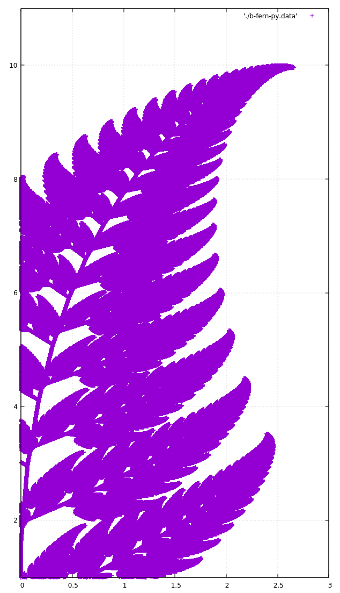

Barnsley Fern
=============

From Wikipedia:
 > The Barnsley fern is a fractal named after the British mathematician Michael Barnsley[1][1]

This contains a Python and C version. Both can write the coordinates to a csv file. The C version can only write 
to a file, and the Python can either write out, plot in Matplotlib, or do both. Currently to change settings in 
either you will need to edit the source file. 

Easiest method of plotting the data is with gnuplot. Once installed, run gnuplot:
`gnuplot`
Then run the command:
`plot 'path/to/coordinates'

gnuplot will not accept the headers that the C writes. I currently have these headers commented out, but if you
would rather plot with something the needs headers, feel free to uncomment and modify, if needed.

Your output will look similar to this:

This image was made with gnuplot, using 10,000 coordinates.

[1]: https://en.wikipedia.org/wiki/Barnsley_fern
